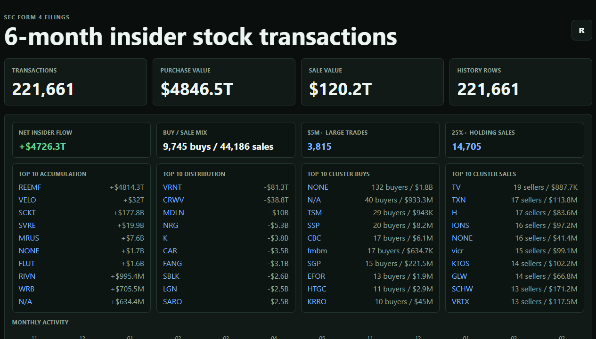
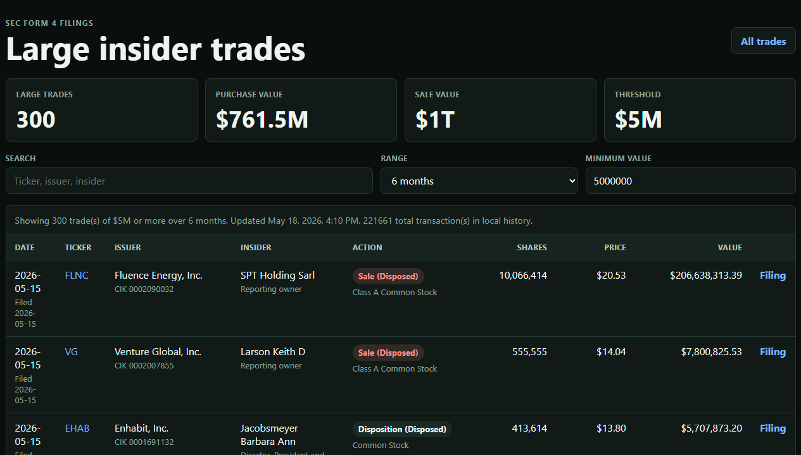
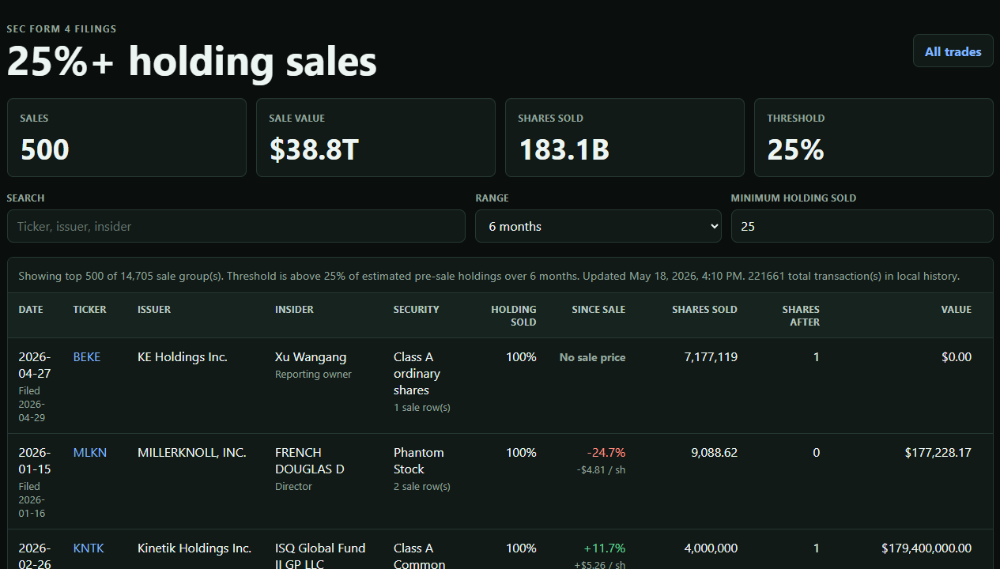

# SEC Form 4 Tracker

A lightweight stock transaction tracker for SEC Form 4 filings over the trailing seven calendar days.
Originally built on Windows, but there is a docker file so it can be platform-agnostic.

## Screenshots

### Dashboard



### Large Trades



### 25%+ Holding Sales



## Run

```powershell
npm start
```

Then open <http://localhost:3080>.

## Scheduled Backfill

For Task Scheduler, prefer the `curl.exe` wrapper over a visible PowerShell web request:

```text
scripts\run-backfill.cmd
```

Suggested task settings:

- Program: `<repo>\scripts\run-backfill.cmd`
- Start in: `<repo>`
- Repeat every: `10 minutes`
- Stop task if it runs longer than: `9 minutes`
- Do not start a new instance if one is already running

The wrapper calls the local HTTP endpoint, reads the collector token from `data\collector-token.txt`, writes the latest response to `logs\backfill-latest.json`, and appends run status to `logs\backfill.log`.

## Docker

Create `.env` from `.env.example` and set `COLLECTOR_TOKEN`, then run:

```powershell
docker compose up -d --build
```

The container exposes:

- HTTP: <http://localhost:3080>
- HTTPS: <https://localhost:3443>

Persistent state and certificates stay on the host:

- `data\form4-history.json`
- `data\collector-state.json`
- `certs\letsencrypt\<domain>-key.pem`
- `certs\letsencrypt\<domain>-chain.pem`

## Local HTTPS

Generate a self-signed localhost certificate:

```powershell
$env:HTTPS_PFX_PASSPHRASE="choose-a-local-passphrase"
npm run cert
npm start
```

Then open <https://localhost:3443>. Your browser may show a warning because this is a local self-signed certificate.

With the generated certificate present, the default ports are:

- HTTPS: <https://localhost:3443>
- HTTP: <http://localhost:3080>

The generated certificate is stored at `certs/localhost.pfx`. Set `HTTPS_PFX_PASSPHRASE` to the same local passphrase before starting the server.

## Let's Encrypt

For a trusted public certificate on Windows, use win-acme and export PEM files:

```powershell
wacs.exe --source manual --host your-domain --validation selfhosting --store pemfiles --pemfilespath "<repo>\certs\letsencrypt" --pemfilesname your-domain --emailaddress your-acme-contact --accepttos
```

The server will automatically prefer:

- `certs\letsencrypt\<domain>-key.pem`
- `certs\letsencrypt\<domain>-chain.pem`

Restart Node after the certificate is issued.

## Notes

- The server reads SEC EDGAR daily form indexes for the trailing dates, filters `Form 4` and `Form 4/A`, fetches filing text files, extracts the embedded ownership XML, and returns parsed transactions to the browser.
- Successful SEC pulls are persisted to `data\form4-history.json`. Normal page loads reuse fresh persisted history; the refresh button forces a live SEC refresh and merges new transactions into local history.
- To backfill history safely, call `/api/backfill?days=180&limit=1000&token=YOUR_TOKEN`. The token is read from `COLLECTOR_TOKEN` or `data\collector-token.txt`. The server caps each authorized backfill batch to 1000 filings and stores progress in `data\collector-state.json`, including the current date and filing offset, so repeated calls incrementally fill history without allowing public users to request excessive SEC traffic. Add `reset=1` once to restart a deeper collection pass from today.
- Collector status is available at `/api/collector/status`.
- Large trades of `$5M+` are available at `/large` and backed by `/api/large-trades`.
- Insider sales above an estimated holding-sold threshold are available at `/holding-sales` and backed by `/api/holding-sales`. The default report shows sale groups above 25% of estimated pre-sale holdings.
- The holding-sales report includes a cached latest-quote comparison against the insider's weighted average sale price, showing both percentage move and dollar-per-share move since the sale.
- The main dashboard includes a market-read layer with net insider flow, buy/sale mix, $5M+ large trade count, top 10 accumulation/distribution, top 10 cluster buys/sales, ticker-level net flow, transaction-code mix, role mix, and range-aware purchase/sale activity. Cluster buying/selling means at least two distinct reporting owners bought or sold the same ticker in the selected view.
- Dashboard filters are shareable with URL parameters such as `/?q=AMD&days=7`, `/?q=AMD&days=1`, and `/large?q=AMD&threshold=5000000`.
- Weekends, holidays, and not-yet-published daily indexes are reported as unavailable indexes in the status line.
- Set a real SEC contact user agent before heavier use. Use your name or app name plus a reachable email address:

```powershell
$env:SEC_USER_AGENT="Your Name SEC Form 4 Tracker your-contact"
npm start
```
